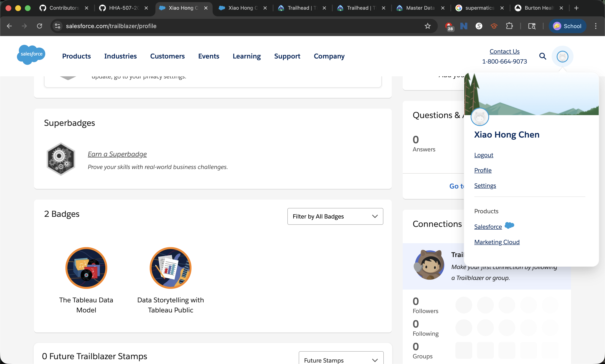
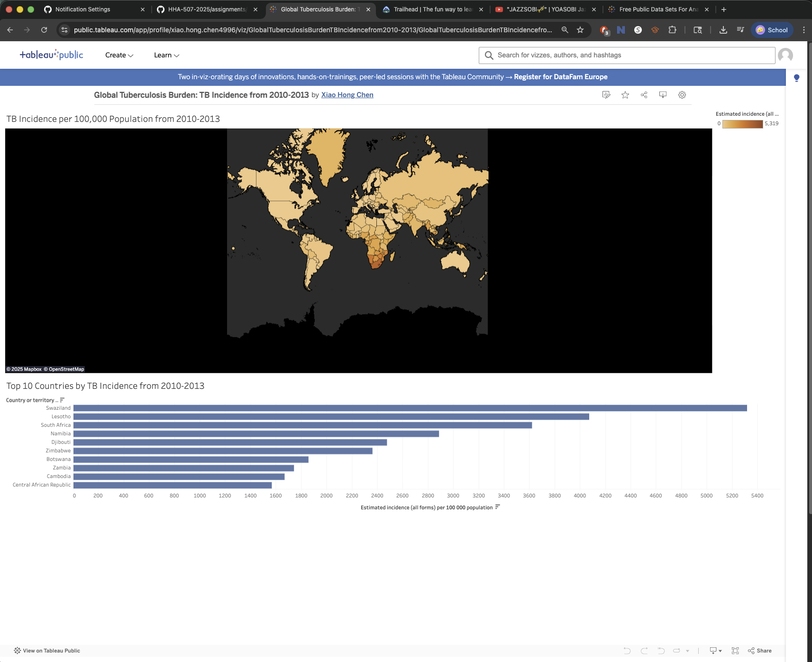

# tableau_trailhead_basics

This repo represents the completion of the Tableau Trailhead modules and a Published Tableau Public visualization.

## Evidence of Completion

### Data Storytelling with Tableau Public and Tableau Data Model

### Tableau Public Visual Using Public Database 

### **[Please click this for Public Tableau URL](https://public.tableau.com/views/GlobalTuberculosisBurdenTBIncidencefrom2010-2013/GlobalTuberculosisBurdenTBIncidencefrom2010-2013?:language=en-US&:sid=&:redirect=auth&:display_count=n&:origin=viz_share_link)**

## Reflection
One key principle from Data Storytelling with Tableau Public that stood out to me was the importance of focusing on one clear message rather than trying to do too much. I reflected and applied this by designing a simple dashboard with a world map and a supporting bar chart to highlight how tuberculosis incidences is unevenly distributed across countries. 

The Tableau Data Model module explained the concept of using relationships instead of traditional joins was particularly important because it allows datasets to remain connected without duplicating data. This matters when working with real-world healthcare data, which is often spread across multiple tables. In a healthcare setting, Tableau could be used to track disease trends or outcomes by combining data from differentr databases such as diagnoses, demographics, and regional indicators. Tableau is a good fit for these scenarios because it allows complex data to be modeled accurately while still presenting in a clear and interpretable way.